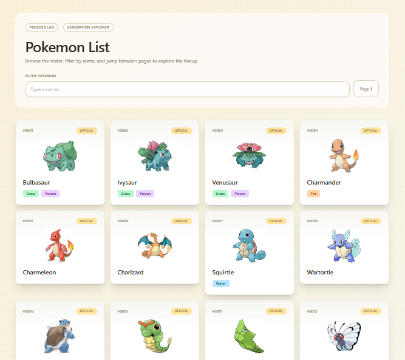
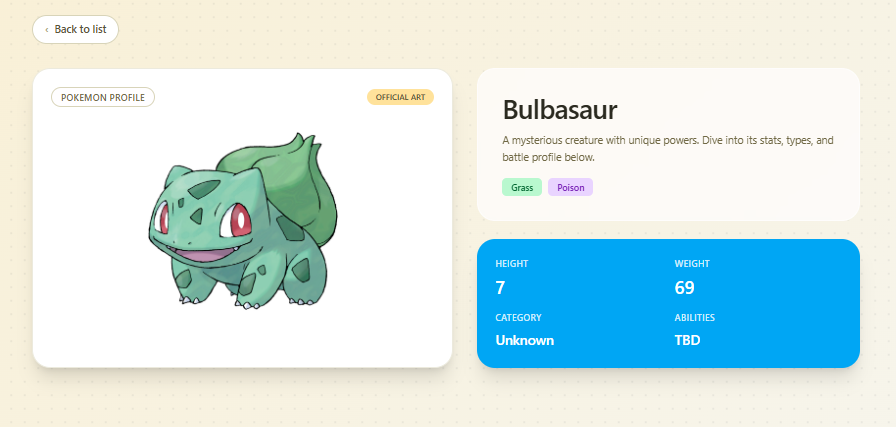
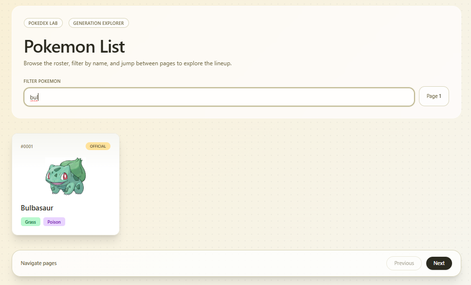

# 🧩 Incubyte Frontend Engineering Kata – Pokémon Explorer

🔗 Live Demo

👉 https://incubyte-frontend-kata-anamika-modi.vercel.app/

👉 Repository: https://github.com/incubyte-hiring/incubyte-frontend-kata-anamikaModi25

# 📸 Screenshots

## Pokémon Listing Page



## Pokémon Detail Page



## Filtering + Pagination



# 🏗 Architecture Overview

### The application follows a feature-based architecture to keep domain logic modular and scalable.

```bash
src/
├── app/ # App configuration (router, providers)
├── features/
│ └── pokemon/
│ ├── api/ # API functions
│ ├── hooks/ # React Query hooks
│ ├── components/ # Reusable UI components
│ ├── pages/ # Route pages
│ └── types.ts
├── Components/ # Shared components (Skeleton)
├── hooks/ # Shared hooks (debounce)
└── test/ # Test setup and MSW server
```

## Why Feature-Based?

- Encapsulates domain logic
- Improves testability
- Easier to scale with additional features
- Avoids global sprawl

# ⚙️ Tech Stack

| Technology            | Purpose                   |
| --------------------- | ------------------------- |
| React + TypeScript    | UI Development            |
| Vite                  | Fast build tool           |
| React Router          | Client-side routing       |
| TanStack Query        | Data fetching and caching |
| MSW                   | API mocking for tests     |
| Vitest                | Unit testing framework    |
| React Testing Library | UI testing                |
| Vercel                | Deployment                |

# 🧪 Testing Strategy (Strict TDD)

### This project follows strict Test Driven Development (TDD).

Workflow used:

```bash
RED → GREEN → REFACTOR
```

- Write failing tests
- Implement minimal code to pass tests
- Refactor while keeping tests green

## Testing Principles

- Tests validate user behavior
- Avoid testing implementation details
- Use MSW to mock network requests
- Ensure tests are fast and deterministic

# Covered Test Scenarios

## Pokémon List Page

✅ Loading state

✅ Error state

✅ Renders list items

✅ Navigation to detail page

✅ Client-side filtering

✅ Debounced filtering

✅ Empty state

✅ Pagination behavior

## Pokémon Detail Page

✅ Loading state

✅ Error state

✅ Rendering detail data

# 🚀 Performance & Scalability Decisions

## Debounced Filtering

Filtering is debounced (300ms) to prevent unnecessary re-renders as dataset grows.

## Pagination

Implemented API-driven pagination:

```bash
?offset=0&limit=20
```

### Benefits:

- Handles large datasets efficiently
- Reduces memory usage
- Improves perceived performance

## React Query

Used for:

- Built-in caching
- Request deduplication
- Automatic loading & error state management

♿ Accessibility Considerations

- `role="status"` for loading indicators
- `role="alert"` for error messages
- Proper `<label>` association with inputs
- Semantic list elements (`ul`,`li`)
- Keyboard-friendly navigation using `Link`

## UX Enhancements

- Skeleton loading UI
- Disabled previous page button on first page
- Clear empty state message
- Responsive layout

# AI Usage (Required by Incubyte)

AI tools were used intentionally to improve development speed while maintaining code quality.

AI was used for:

- Scaffolding initial project structure
- Generating test case ideas
- Assisting with MSW mocking patterns
- Drafting documentation structure

All architecture decisions and implementation details were reviewed and refined manually.

AI was used as an assistant, not a replacement for engineering decisions.

# Git Commit Strategy (TDD)

Commits follow the RED → GREEN → REFACTOR pattern.

Example commit history:

```bash
test: add failing test for pokemon list rendering
feat: implement minimal list rendering
refactor: extract PokemonCard component

test: add failing test for filtering
feat: implement filtering logic
refactor: add debounce hook

test: add pagination tests
feat: implement API pagination

test: add detail error state test
feat: implement accessible error state
```

Each feature started with a failing test.

# Setup Instructions

Clone Repository

```bash
git clone https://github.com/your-username/incubyte-pokemon-kata
cd incubyte-pokemon-kata
```

# Install Dependencies

```bash
npm install
```

# Run Development Server

```bash
npm run dev
```

# Run Tests

```bash
npm run test
```

# Run Coverage

```bash
npm run coverage
```

# 🌍 Deployment

The application is deployed on Vercel.

Deployment Steps

- Push repository to GitHub
- Go to https://vercel.com
- Import project
- Use default Vite configuration

# Deploy

## Build command:

```bash
npm run build
```

# Trade-offs

## Client-side Filtering

Filtering is implemented on the client for simplicity and responsiveness.
For larger datasets, server-side filtering would be preferable.

## No Global State Management

Redux or Zustand were not introduced since application state remains localized and manageable.

## Pagination Instead of Infinite Scroll

Pagination provides deterministic UI behavior and simpler testing compared to infinite scrolling.

# Possible Future Improvements

- Pokémon image rendering

- Filtering by Pokémon type

- Animated skeleton loaders

- Retry mechanism for failed requests

- Suspense integration

- End-to-end tests using Playwright
